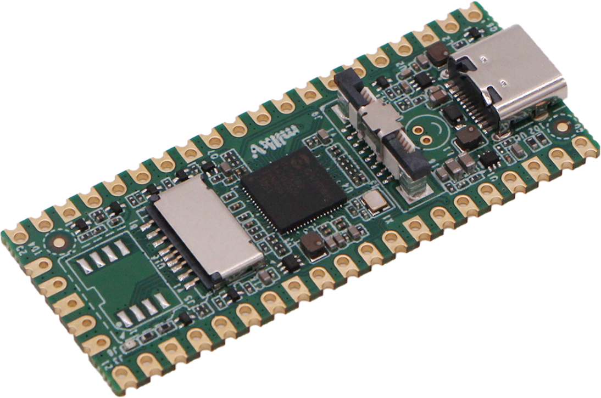

# Milk-V Duo 概述

## 概述

Milk-V Duo 是一款基于 CV1800B 芯片的超紧凑型嵌入式开发平台。 它可以运行 Linux 和 RTOS，为专业人士、工业 ODM、AIoT 爱好者、DIY 爱好者和创作者提供可靠、低成本、高性能的平台。
## 硬件规格

- 处理器：CVITEK CV1800B (C906@1Ghz + C906@700MHz)
- 内存：DDR2 64MB
- 存储：1x Mirco SD slot,1x SD NAND solder pad
- 接口：
	- 1x Type-C for data and Power,1x USB2 solder pad
	- 1x 16P FPC connector (MIPI CSI 2-lane)
	- up to 26 Pins available for general purpose I/O（GPIO）
- 电源：USB‑C 5V

