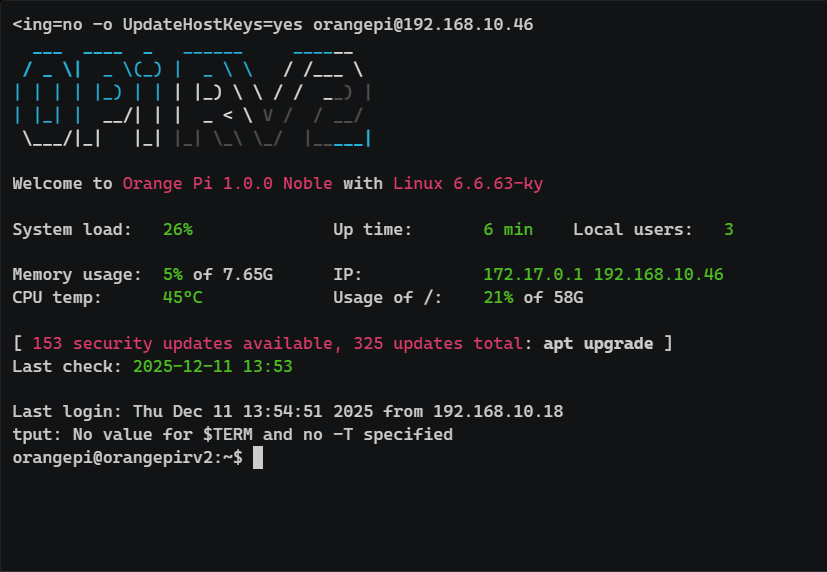

# OrangePi_RV2  系统版本和工具链测试报告

## 测试环境

### 操作系统信息

- 系统版本：Orange Pi OS v1.0.0 Noble
- 下载链接：<http://www.orangepi.org/html/hardWare/computerAndMicrocontrollers/service-and-support/Orange-Pi-RV2.html>
- 参考安装文档：<http://www.orangepi.org/orangepiwiki/index.php/Orange_Pi_RV2>

### 硬件信息

- OrangePi_RV2
	- 设备照片
	- 设备型号截图
	- 系统信息截图
- USB-C 电源适配器一个 
- microSD 卡一张 
- USB 转 TTL 串口调试器 
- 散热风扇 

## 操作系统安装与启动验证

### 下载 OrangePi_RV2 的镜像

从[下载链接](http://www.orangepi.org/html/hardWare/computerAndMicrocontrollers/service-and-support/Orange-Pi-RV2.html)下载所需镜像。并解压
```shell
7z x Orangepirv2_1.0.0_ubuntu_noble_desktop_gnome_linux6.6.63.7z
```

### 刷写镜像

用 dd 刷写镜像到 sd 卡：
```shell
sudo dd if=Orangepirv2_1.0.0_ubuntu_noble_desktop_gnome_linux6.6.63.img of=/dev/sdX bs=4M status=progress conv=fsync
```
### 登录系统
#### 通过网络 SSH 连接 

**连接网络**: 用网线将 Orange Pi RV2 连接到路由器。
**查找 IP**: 登录路由器后台， 找到设备名为 `orangepirv2` 的 IP 地址。

#### 打开终端，使用SSH
```
默认账号: orangepi

默认密码: orangepi
```


## 工具链测试

安装依赖包
```
sudo apt update; sudo apt install -y wget tar zstd xz-utils git build-essential
```

安装ruyi包管理器
```
wget https://mirror.iscas.ac.cn/ruyisdk/ruyi/tags/0.41.0/ruyi-0.41.0.riscv64

chmod +x ruyi-0.41.0.riscv64

sudo cp -v ruyi-0.41.0.riscv64 /usr/local/bin/ruyi
```

安装GCC和LLVM工具链
```
ruyi update

ruyi install gnu-plct llvm-plct
```

### GCC测试
创建并激活ruyi虚拟环境（GCC）
```
ruyi venv -t toolchain/gnu-plct milkv-duo venv-gnu-plct-duo

. ~/venv-gnu-plct/bin/ruyi-activate
```

验证GCC版本

```
riscv64-plct-linux-gnu-gcc -v
```

编译Hello World（GCC）

```
cat << EOF > hello.c

#include <stdio.h>

int main() {

    printf("Hello, World!\n");

    return 0;

}

EOF

riscv64-plct-linux-gnu-gcc hello.c -o hello-gcc

```

编译coremark（GCC）

```
git clone https://github.com/eembc/coremark

cd coremark

make CC=riscv64-plct-linux-gnu-gcc XCFLAGS="-mcpu=thead-c906 -static" compile

mv coremark.exe coremark-gcc
```

将GCC构建的二进制传输至开发板

```
scp ../hello-gcc coremark-gcc root@192.168.42.1:~
```

返回上级目录并退出ruyi GCC虚拟环境

```
cd ..; ruyi-deactivate
```

### LLVM测试
创建并激活ruyi虚拟环境（LLVM）

```
ruyi venv -t toolchain/llvm-plct manual --sysroot-from gnu-plct venv-llvm-plct

. ~/venv-llvm-plct/bin/ruyi-activate
```
验证LLVM版本

```
clang -v
```

编译Hello World（LLVM）

```
clang hello.c -o hello-llvm; 
```


编译coremark（LLVM）

```
cd coremark; make clean

make CC=clang XCFLAGS="-march=rv64imafdc_xtheadba_xtheadbb_xtheadbs_xtheadcmo_\

xtheadcondmov_xtheadfmemidx_xtheadmac_xtheadmemidx_xtheadmempair_xtheadsync -static" compile

mv coremark.exe coremark-llvm
```

将LLVM构建的二进制传输到开发板

```
scp ../hello-llvm coremark-llvm root@192.168.42.1:~
```

返回上级目录并退出ruyi GCC虚拟环境

```
cd ..; ruyi-deactivate
```

SSH连接到开发板并执行编译好的二进制

```

./hello-gcc
```

```
./hello-llvm
```

```
./coremark-gcc
```

```
./coremark-llvm
```


## 完整测试过程

屏幕录制

[](https://asciinema.org/a/lYgXiWJ5moHHpxhs)
## 预期结果

在本次测试中，预期达到以下成果：

1. **系统初始化完成**  
    成功完成开发板系统镜像的下载与烧录（如 RevyOS、Ubuntu、Debian 等），能够通过串口正常登录系统，并完成基础网络配置，确保开发板具备后续测试所需的运行环境。
    
2. **RuyiSDK 编译环境可用**  
    在目标系统中成功安装必要的系统依赖（如 `build-essential`、`git`、`wget` 等），完成 Ruyi 包管理器（v0.40.0）的安装，并通过 Ruyi 正常安装 `gnu-plct` 与 `llvm-plct` 工具链。
    
3. **GCC 工具链功能验证**  
    成功创建并激活 GCC 虚拟环境，能够正确识别 GCC 版本；使用 GCC 工具链完成 Hello World 程序的编译与运行，并完成 Coremark 基准测试的编译与运行。
    
4. **LLVM 工具链功能验证**  
    成功创建并激活 LLVM 虚拟环境，能够正确识别 Clang 版本；使用 LLVM 工具链完成 Hello World 程序的编译与运行，并完成 Coremark 基准测试的编译与运行（针对部分开发板，按要求设置对应的 `-march` 编译参数）。
    
5. **测试流程完整**  
    测试完成后可正常退出虚拟环境。

## 实际结果

本次测试实际取得的成果如下：

1. **系统初始化结果**  
    已完成目标开发板系统镜像的烧录与部署，开发板可通过串口成功登录系统，并完成基础网络配置，系统运行稳定，满足测试需求。
    
2. **RuyiSDK 环境部署结果**  
    系统依赖包安装完成，Ruyi 包管理器（v0.40.0）安装成功；通过 Ruyi 包管理器成功安装 `gnu-plct` 与 `llvm-plct` 工具链，相关命令可正常执行。
    
3. **GCC 工具链测试结果**  
    GCC 虚拟环境创建与激活成功，GCC 版本信息可正确获取；Hello World 程序可正常编译并在开发板上运行；Coremark 基准测试可成功编译并运行，输出结果符合预期。
    
4. **LLVM 工具链测试结果**  
    LLVM 虚拟环境创建与激活成功，Clang 版本信息可正确获取；Hello World 程序可正常编译并运行；Coremark 基准测试在已支持的开发板上可成功编译并运行，部分开发板在测试过程中按要求指定了对应的 `-march` 编译参数。
    
5. **测试流程完成情况**  
    所有测试步骤执行完成后，虚拟环境可正常退出，测试流程与操作步骤已通过截图与录屏方式记录，测试结果可追溯、可复查。

## 测试判定标准

测试成功：实际结果与预期结果相符。

测试失败：实际结果与预期结果不符。

## 测试结论

测试成功。